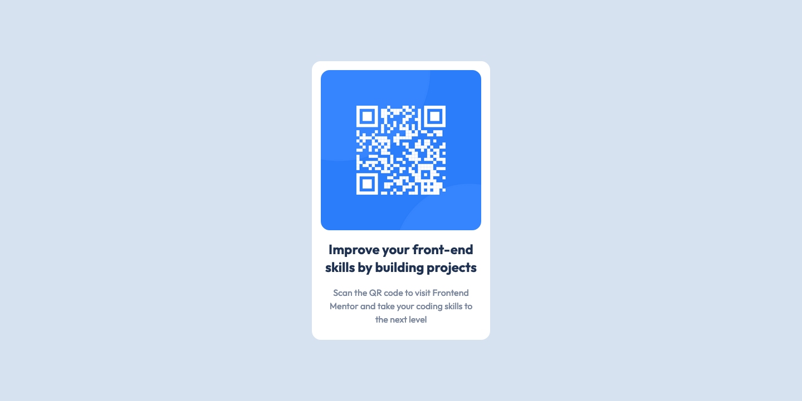

# Frontend Mentor - QR code component solution

This is a solution to the [QR code component challenge on Frontend Mentor](https://www.frontendmentor.io/challenges/qr-code-component-iux_sIO_H).

## Table of contents

- [Overview](#overview)
  - [Screenshot](#screenshot)
  - [Links](#links)
- [My process](#my-process)
  - [Built with](#built-with)
  - [What I learned](#what-i-learned)
  - [Useful resources](#useful-resources)
- [Author](#author)

## Overview

### Screenshot

### Links

- Solution URL: [Add solution URL here](https://your-solution-url.com)
- Live Site URL: [qr.hassanaamer.com](http://exquisite-queijadas-d162b1.netlify.app)

## My process

### Built with

- Semantic HTML5 markup
- CSS custom properties
- CSS Grid
- Mobile-first workflow

### What I learned

* Mobile-first development worflow and how to work with custom CSS properties to improve code reuse.
* The importance of using a good CSS reset in your project to make devlopment experience smoother.
* The importance of the proper use of semantic HTML to improve accessibility.

### Useful resources

- [Josh's CSS Reset](https://www.joshwcomeau.com/css/custom-css-reset/) - I used this CSS reset and I will use it more going forward
- [Kevin Powell's Youtube Channel](https://www.youtube.com/@KevinPowell) - This youtube channel has guided me immensely throughout my frontend journey, so much golden stuff is contained in it.

## Author

- LinkedIn - [Hassan Aamer](https://www.linkedin.com/in/hassan-aamer/)
- Frontend Mentor - [@yourusername](https://www.frontendmentor.io/profile/HassanAamer)
